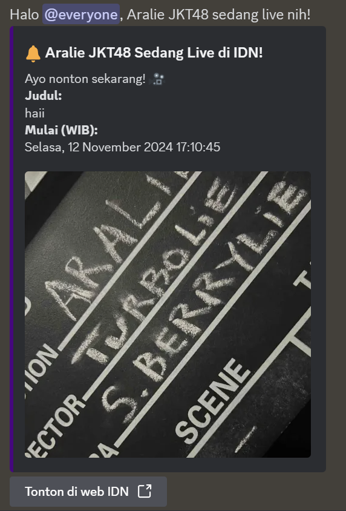
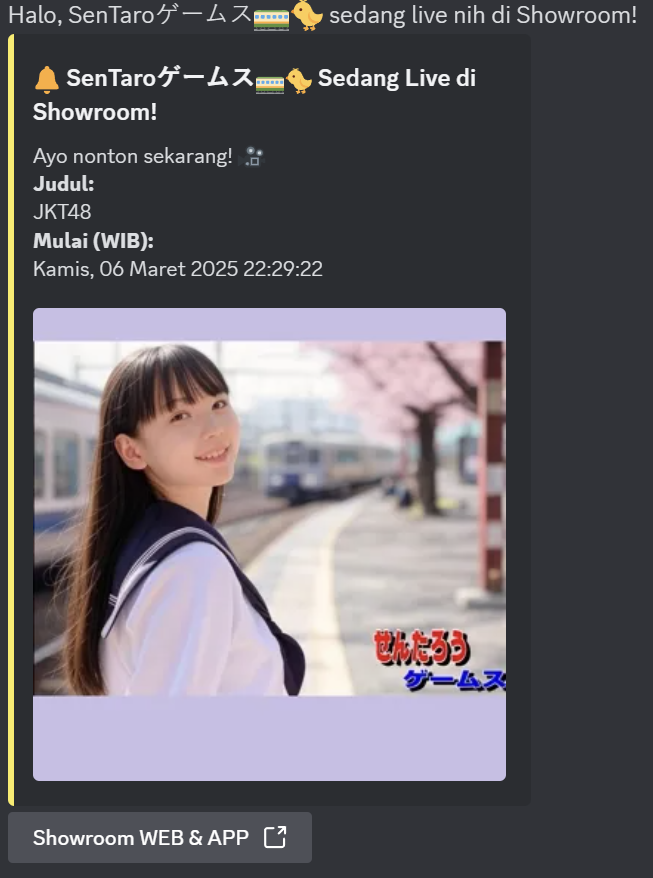

# 📡 Discord Livestream Notification Bot

Bot ini berfungsi untuk mengirim notifikasi livestream secara otomatis ke channel Discord berdasarkan data dari:
- [IDN Live](https://www.idn.app/)
- [Showroom Live](https://www.showroom-live.com/)

## ✨ Fitur Utama
- Cek livestream IDN dan Showroom secara berkala (setiap 30 detik).
- Mengirim notifikasi ke channel Discord jika member yang ditentukan sedang live.
- Memberitahu durasi dan total view setelah live berakhir.
- Menggunakan sistem cache agar tidak mengirim notifikasi yang sama berulang kali.

## 📦 Dependencies
- `discord.js` (v14)
- `node-fetch` (v2)
- `cron`

## 🧪 Contoh Idn Notifikasi Discord


## 🧪 Contoh Notifikasi Discord


## 📂 Instalasi

1. Clone atau download project ini:
   ```bash
   git clone https://github.com/Hxxn-hx/Discord-notification-live-jkt48.git
   cd Discord-notification-live-jkt48
